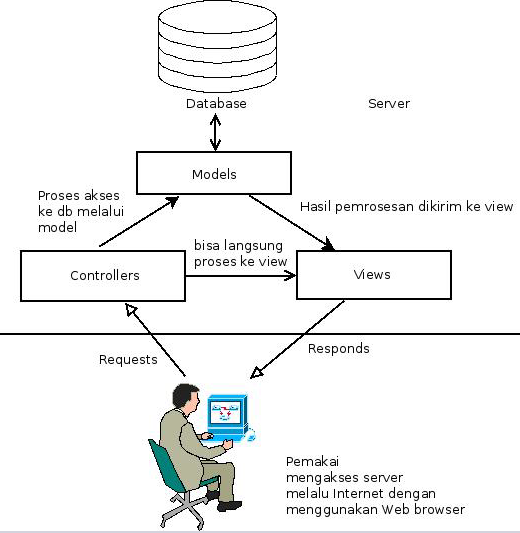

# Minggu 02

## Hari 1: Mengenal Framework Express

### Tujuan

1. Siswa memahami kegunaan dan ruang lingkup aplikasi serta arsitektur dasar dari Express
2. Siswa memahami dan mampu melakukan proses instalasi serta konfirgurasi aplikasi berbasis Express
3. Siswa memahami dan bisa menerapkan struktur dasar aplikasi Express untuk membangun aplikasi Web
4. Siswa memahami penggunaan *express generator* dan bisa menggunakannya untuk membuat rerangka
   aplikasi Express.
5. Siswa memahami dan mampu menggunakan *routing* dasar untuk mengelola bagian aplikasi Express
6. Siswa memahami dan mampu mengelola *static files* di Express

### Pembahasan

1. Pengenalan Express
2. Instalasi dan konfigurasi Express
3. Struktur dasar aplikasi dengan Express
4. Express *generator*
5. Memahami *routing* di Express
6. Mengelola *static files*.

### Pembelajaran

```
Materi dan Penjelasan
```

1. [Halaman Wikipedia untuk Express](https://en.wikipedia.org/wiki/Express.js) memberikan gambaran umum tentang Express. [Halaman Web dari Express](http://expressjs.com/) juga memberikan gambaran umum dari Express.
2. Pahami [Gloassary](http://expressjs.com/en/resources/glossary.html) supaya bisa mengetahui
   istilah-istilah yang muncul saat membahas Express.
3. [Instalasi Express](http://expressjs.com/en/starter/installing.html) menjelaskan cara menginstall
   Express.
4. [Hello World di Express](http://expressjs.com/en/starter/hello-world.html) menjelaskan tentang
   struktur dasar aplikasi Express serta cara menjalankan aplikasi tersebut.
5. [express-generator](http://expressjs.com/en/starter/generator.html) - lihat juga di [repo
   Github](https://github.com/expressjs/generator) - adalah aplikasi kecil untuk membuat rerangka
   aplikasi menggunakan Express.
6. *Routing* merupakan cara aplikasi untuk menanggapi *request* dari klien Web. Pelajari [routing
   dasar](http://expressjs.com/en/starter/basic-routing.html) di Express.
7. Setiap aplikasi Web biasanya juga mempunyai file-file yang bersifat status (JS sisi klien,
   file-file gambar, CSS, dan lain-lain). Express menyediakan [fasilitas untuk mengelola
   *static-files*](http://expressjs.com/en/starter/static-files.html).

```
Latihan
```

1. Install Express, kerjakan contoh point 4 di atas. Push ke repo, jelaskan dalam suatu file
   README.md.
2. Gunakan `express-generator` untuk membuat rerangka aplikasi standar di Express. 
3. Tambahkan minimal 3 *routing* serta penanganannya di aplikasi yang anda *generate* di atas.
4. Tambahkan pada salah satu *routing* yang anda buat tersebut, 1 untuk menangani *request*
   menampilkan kalendar. Lihat
   [artikel](https://code-boxx.com/simple-pure-javascript-calendar-events/) ini untuk integrasi
   kalendar berbasis HTML-CSS-JavaScript. Latihan ini akan melatih seberapa paham anda
   mengintegrasikan *static files* ke Express. Untuk saat ini, tidak perlu memikirkan implementasi
   dari kalendar tersebut ke basis data dan lain-lain, yang penting ada definisi *routing* dan
   definisi tersebut akan mengarah ke halaman yang menampilkan kalendar.

```
Kasus
```

Buatlah aplikasi kalkulator di JavaScript dengan menggunakan Express. Halaman Web yang tampil akan
meminta input untuk 2 angka serta memilih operator (x, /. +, -). Khusus untuk pembagian, angka
pembagi tidak boleh 0. Bagian Express (*back end*) akan memproses input tersebut dan menampilkan
hasil kalkukator.

## Hari 2: Express dan MVC

### Tujuan

1. Siswa memahami pola arsitektur software MVC
2. Siswa memahami komponen-komponen MVC pada Express
3. Siswa mampu membuat struktur proyek MVC pada Express
4. Siswa mampu membangun aplikasi dengan pola MVC menggunakan Express

### Pembahasan

1. Memahami pola MVC
2. Komponen MVC di Express

### Pembelajaran

```
Materi dan Penjelasan
```

1. [MVC di Wikipedia](https://en.wikipedia.org/wiki/Model%E2%80%93view%E2%80%93controller)
   menjelaskan secara umum tentang pola MVC.
2. Gambar berikut ini menjelaskan tentang pola MVC pada aplikasi Web:



3. [Contoh MVC di Express](https://github.com/expressjs/express/tree/master/examples/mvc) adalah
   contoh aplikasi Express yang dibuat dengan menggunakan pola MVC.

```
Latihan
```

1. Carilah contoh aplikasi MVC di Internet yang dibuat dengan menggunakan Express tanpa akses ke
   database. Masukkan ke repo anda, sertakan URL asal dari aplikasi tersebut. Jelaskan kegunaan
   aplikasi tersebut serta cara menjalankannya.

```
Kasus
```

Kerjakan no 3 pada materi dan penjelasan di atas. Identifikasikan komponen-komponen M, V, dan C dari
aplikasi tersebut. Buat dokumen tentang komponen-komponen yang sudah anda identifikasi tersebut.

## Hari 3: Routing dan Handler pada Express

### Tujuan

1. Siswa memahami pengertian *routing* dan konfigurasi yang diperlukan untuk *routing*
2. Siswa mehamami keterkaitan antara *routing* dengan *handler*
3. Siswa memahami cara mendefinisikan *route* yang menyertakan *HTTP methods*.
4. Siswa memahami penggunaan *regular expression* dalam definisi *routing*
5. Siswa memahami dan mampu membuat *HTTP request methods* 
6. Siswa memahami berbagai macam tipe *response* (JSON, file teks biasa, dan lain) serta bisa
   menerapkan berbagai macam tipe *response*.

### Pembahasan

1. Pengertian *routing*
2. *Routing* dan *handler*
3. *Routes* dan HTTP *methods*.
4. *Routes* dan *regular expression*
5. *Route* dan parameter dari *requests*
6. *Response methods*

### Pembelajaran

```
Materi dan Penjelasan
```

1. [Panduan lengkap *routing* di Express](http://expressjs.com/en/guide/routing.html)

```
Latihan
```

1. Kerjakan berbagai contoh *routing* yang ada pada materi dan penjelasan nomor 1 di atas.


```
Kasus
```

1. Buatlah aplikasi Web menggunakan Express. Aplikasi ini berfungsi sebagai aplikasi kalkulator dengan operasi: perkalian (x), pembagian (/), penambahan (+), dan pengurangan (-). Input berupa angka 1 dan angka 2 serta operator yang dipilih. Setelah submit:
    * Jika operator yang dipilih adalah pembagian dan angka 2 (pembagi) adalah angka 0, maka akan  ditampilkan error: "Tidak boleh mengisikan angka 0 sebagai pembagi".
    * Selain itu, tampilkan hasil operasi.
2. Ubahlah aplikasi tersebut sehingga bisa menerima *routing*:
    * http://server/kali/2/3 => menampilkan hasil 5
    * http://server/bagi/3/0 => menampilkan error tidak boleh dibagi dengan angka 0
    * http://server/bagi/6/2 => menampilkna hasil 3
    * http://server/tambah/4/3 => menampilkan hasil 7
    * http://server/kurang/5/2 => menampilkan hasil 3

## Hari 4: Penanganan Error dan Template Engine

### Tujuan

1. Siswa memahami dan bisa menerapkan cara menangani error di Express
2. Siswa memahami cara kerja *template engine* di Express
3. Siswa memahami dan bisa mengintegrasikan template engine default (Pug) ke dalam aplikasi Express.
4. Siswa memahami sintaksis Pug dan penggunaannya
5. Siswa bisa membuat *template engine* sendiri dan mengintegrasikannya ke Express.

### Pembahasan

1. Error dan penanganannya
2. Memahami cara kerja *template engine*
3. Konfigurasi *template engine*
4. Lebih lanjut dengan Pug
5. Membuat *template engine* sendiri

### Pembelajaran

```
Materi dan Penjelasan
```

1. Express menyediakan [error handler](http://expressjs.com/en/guide/error-handling.html) default
   maupun error handler yang ditulis sendiri.
2. [Halaman Wikipedia untuk *template processor*](https://en.wikipedia.org/wiki/Template_processor)
   menyediakan gambaran umum tentang *template engine* yang tidak hanya untuk Web saja.
3. [Halaman Wikipedia untuk *Web template
   system*](https://en.wikipedia.org/wiki/Web_template_system) menyediakan uraian dan gambaran umum
   tentang *template engine* khusus untuk Web. [Halaman
   perbandingan](https://en.wikipedia.org/wiki/Comparison_of_web_template_engines) menyediakan
   informasi tentang berbagai *template engine* untuk Web.
4. [Dokumentasi integrasi Pug ke Express](http://expressjs.com/en/guide/using-template-engines.html)
   menyediakan langkah-langkah dan cara integrasi Pug ke Express.
5. [Website Pug](https://pugjs.org) menyediakan informasi lengkap tentang template yang dibuat
   menggunakan Pug.
6. [Dokumentasi](http://expressjs.com/en/advanced/developing-template-engines.html) di Express untuk
   membuat *template engine* sendiri.
7. Beberapa *template engine* lain yang bisa digunakan di Pug:
    * [Mustache](https://github.com/janl/mustache.js)
    * [ejs](https://github.com/mde/ejs)

```
Latihan
```

1. Buatlah aplikasi baru, integrasikan Pug ke aplikasi baru tersebut, tampilkan "hello {{nama}}" dengan
   menggunakan Pug. Ganti {{nama}} dengan input dari aplikasi (HTML INPUT tag di form).
2. Buat seperti nomor 1, tetapi menggunakan Mustache dan ejs.

```
Kasus
```

1. Untuk aplikasi hari 3 kemarin (kalkulator), gunakan fasilitas *error handling* dari Express.
2. Buatlah *template engine* anda sendiri, masukkan ke repo GitHub anda dengan nama tersendiri. Repo
   GitHub untuk hari ini berisi penjelasan tentang repo anda tersebut.

## Hari 5: Middleware

### Tujuan

1. Siswa memahami pengertian *middleware* di Express
2. Siswa memahami mengapa memerlukan *middleware*
3. Siswa memahami cara menggunakan *middleware* di Express
4. Siswa memahami berbagai tipe *middleware* dan bisa menggunakan berbagai tipe tersebut pada
   Express.

### Pembahasan

1. Pengertian *Middleware*
2. Mengepa perlu *middleware*
3. Tipe-tipe *middleware*

### Pembelajaran

```
Materi dan Penjelasan
```

1. [Dokumentasi - menggunakan *middleware* di Express](http://expressjs.com/en/guide/using-middleware.html).
2. [Dokumentasi - membuat  *middleware*](http://expressjs.com/en/guide/writing-middleware.html).
3. [Penjelasan tentang *middleware*](https://medium.com/@agoiabeladeyemi/a-simple-explanation-of-express-middleware-c68ea839f498), juga [di blog ini](https://medium.com/@selvaganesh93/how-node-js-middleware-works-d8e02a936113]). [Build and Understand Express Middleware through Examples](API Reference](http://expressjs.com/en/4x/api.html) menampilkan beberapa *built-in middleware*.
5. [3rd Party *middleware*](http://expressjs.com/en/resources/middleware.html).


```
Latihan
```

1. Pada materi dan penjelasan nomor 1 di atas, kerjakan semua kode sumber disitu. Sesuaikan dengan tipe *middleware*, jadi jika tipe *middleware* adalah *application middleware*, kerjakan contoh disitu sehingga bisa digunakan menjadi satu aplikasi yang benar-benar bisa dijalankan. Anda boleh dan bebas mengatur berbagai file yang diperlukan.


```
Kasus
```

Buatlah *middleware* yang berfungsi untuk mengambil karakter saja dari suatu data *request* yang
dikirim, selain karakter alfabet (a-z, A-Z), Skemanya adalah sebagai berikut:


```bash

+--------+    data: 234hello^#^#        +---------+
| client | -------------------------->  | server ]
| Web    | <--------------------------  |        |        |
+--------+         hello                *--------+

```
